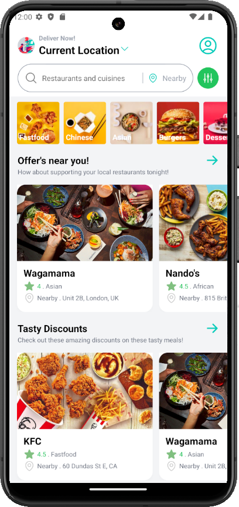
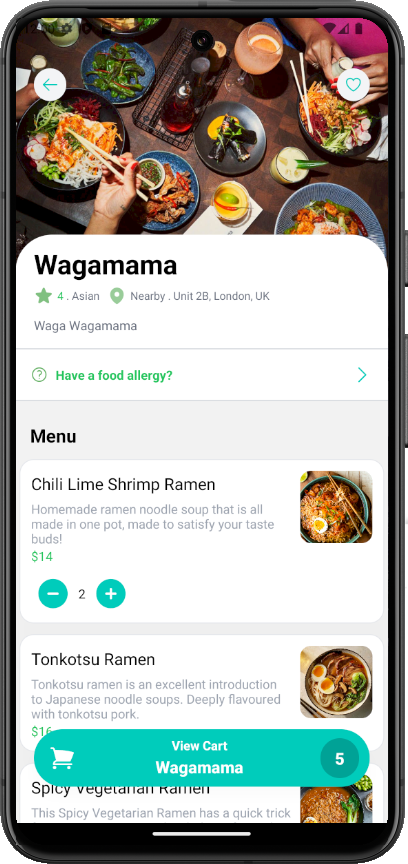
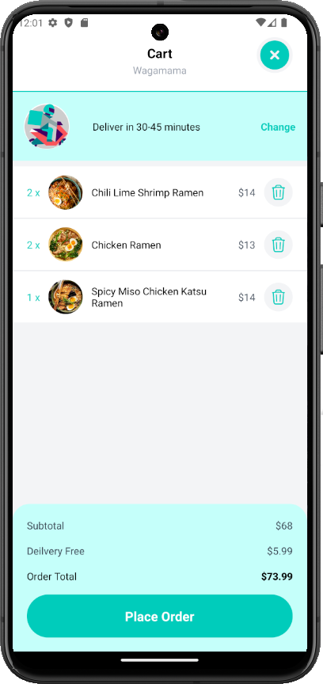
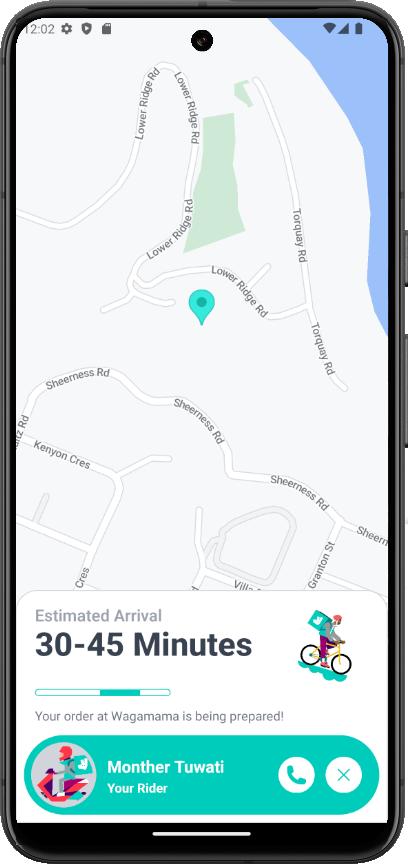

# Food Delivery App with `REACT NATIVE!` (Navigation, Redux, Tailwind CSS & Sanity.io) :motor_scooter:

### Technologies

- `React-Native`
- `Expo`
- `Tailwind CSS` with `NativeWind`
- `React Navigation`
- `Redux`
- `react-native-maps` with Google Map API
- `Sanity.io`

### Screenshots & video 🌃

<div style="display: flex; flex-wrap: wrap">




</div>


## :toolbox: Getting Started

### :bangbang: Prerequisites

- Sign up for a Sanity account <a href='https://www.sanity.io'>HERE</a>
- Install Node JS in your computer <a href='https://nodejs.org/en/'>HERE</a>

### :gear: Installation


Install my-project with expo


Installing Expo CLI

```
npm install --global expo-cli
```

Initializing the project

```
npx create-expo-app deliveroo-clone
```

```
cd deliveroo-clone
```

Install dependencies

### Setup Tailwind CSS


```
npm install nativewind
npm install --save-dev tailwindcss@3.3.2
```

Run npx tailwindcss init to create a `tailwind.config.js` file

Add the paths to all of your component files in your `tailwind.config.js` file. Remember to replace `<custom directory>` with the actual name of your directory e.g. screens.

```
// tailwind.config.js
module.exports = {
  content: [
    "./screens/**/*.{js,ts,jsx,tsx}",
    "./pages/**/*.{js,ts,jsx,tsx}",
    "./components/**/*.{js,ts,jsx,tsx}",
  ],
  // ...
};
```

Add `NativeWindStyleSheet` at the top level of your application. The `NativeWindStyleSheet` creates the context for reactive styles and the atomic style objects.

```
import { NativeWindStyleSheet } from "nativewind";

NativeWindStyleSheet.setOutput({
  default: "native",
});
```

##### Configure your babel.config.js

```
// babel.config.js
module.exports = function (api) {
  api.cache(true);
  return {
    presets: ["babel-preset-expo"],
+   plugins: ["nativewind/babel"],
  };
};

```

Install dependencies

<a href="https://github.com/MontherTuwati/food-delivery-app/blob/main/package.json" target="_blank">🔶 Dependency Info</a>

<!-- Run Locally -->

### :running: Run Locally


Clone the project

```bash
  git clone https://github.com/MontherTuwati/food-delivery-app.git
```

change directory

```bash
  cd Deliveroo-Clone
```

Install dependencies

```bash
  npx expo install
```

Start the server

```bash
  npx expo start
```

<hr />

### Creating a Build

- Optimize the assets for speed - `npx expo-optimize` (formerly expo optimize)
- Bundle the project for production - `npx expo export:web` (`expo build:web` in the legacy Expo CLI).
- Creates a production ready static bundle in the `web-build/` directory. Don't edit this folder directly.
- If you make any changes to your project, you'll need to re-build for production.
- For more help use `npx expo export:web --help`
- <a href="https://docs.expo.dev/eas" target="_blank">More Info</a>

<!-- Deployment -->

### :triangular_flag_on_post: Deployment

To deploy this project run

#### Expo Publish


publish your project

```
expo publish
```

### License

[MIT](https://choosealicense.com/licenses/mit/)
